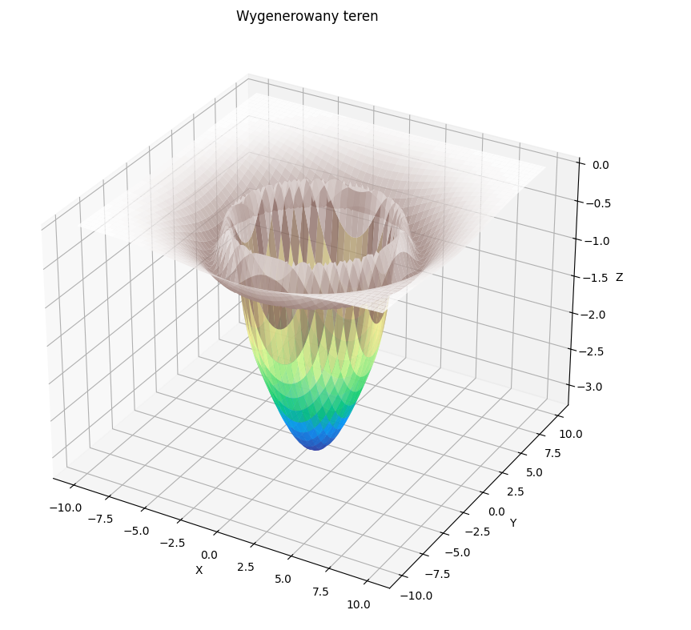
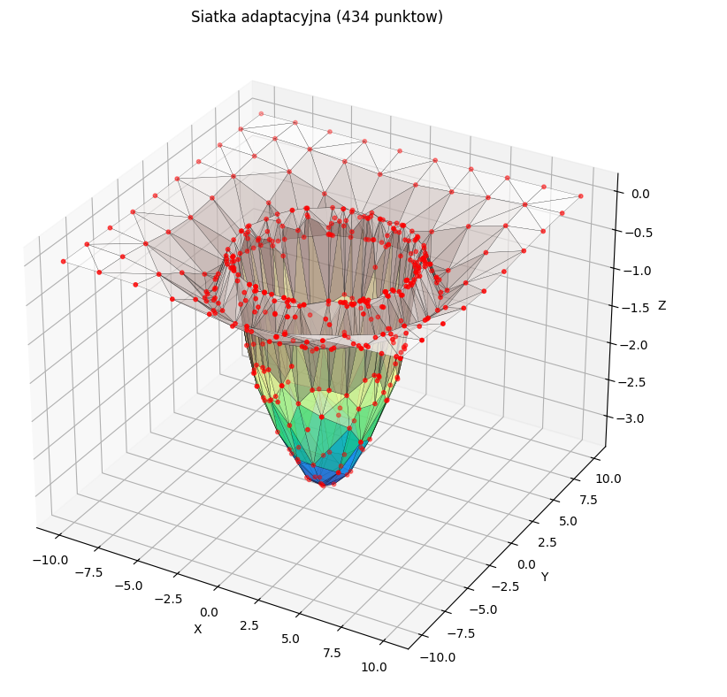
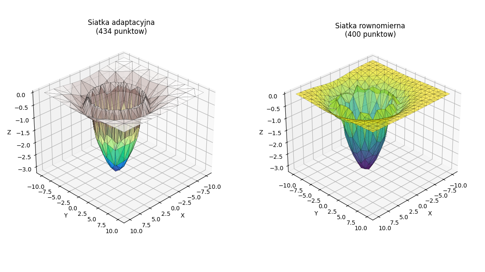

# 🗺️ AdaptiveTerrainMeshingApp3D

> **PL** | Interaktywna aplikacja do adaptacyjnego siatkowania terenu 3D z automatycznym zagęszczaniem siatki w obszarach o dużej krzywiźnie.
>
> **EN** | Interactive 3D terrain adaptive meshing application that automatically refines the mesh in high-curvature regions.

---

## 🇵🇱 Opis projektu

Aplikacja realizuje **adaptacyjne siatkowanie przestrzeni 3D** — w odróżnieniu od siatki równomiernej, punkty siatki są rozmieszczane gęściej tam, gdzie teren jest bardziej złożony (doliny, szczyty, grzbiety), a rzadziej tam, gdzie jest płaski. Podejście to pozwala uzyskać dokładną reprezentację terenu przy mniejszej całkowitej liczbie punktów.

Algorytm oparty jest na **triangulacji Delaunaya** i iteracyjnym udoskonalaniu siatki: w każdej iteracji obliczany jest błąd aproksymacji dla każdego trójkąta (interpolacja barycentryczna vs. rzeczywiste wartości), a nowe punkty są wstawiane tam, gdzie błąd przekracza zadany próg.

## 🇬🇧 Project Description

The application implements **adaptive 3D space meshing** — unlike a uniform mesh, grid points are placed more densely where the terrain is complex (valleys, peaks, ridges) and sparser on flat areas. This yields an accurate terrain representation while keeping the total point count low.

The algorithm is based on **Delaunay triangulation** and iterative mesh refinement: at each iteration, the approximation error is computed for every triangle (barycentric interpolation vs. ground truth), and new points are inserted wherever the error exceeds a given threshold.

---

## ✨ Funkcje / Features

| 🇵🇱 | 🇬🇧 |
|-----|-----|
| 4 typy generowanego terenu | 4 procedurally generated terrain types |
| Iteracyjne udoskonalanie siatki (triangulacja Delaunaya) | Iterative mesh refinement (Delaunay triangulation) |
| Konfigurowalny próg błędu i liczba iteracji | Configurable error threshold and iteration count |
| Porównanie siatki adaptacyjnej z równomierną | Comparison between adaptive and uniform mesh |
| Analiza mapy błędów aproksymacji | Approximation error map analysis |
| Interaktywna wizualizacja 3D (matplotlib) | Interactive 3D visualization (matplotlib) |
| Panel logów z czasem działania | Log panel with execution timing |

---

## 🏔️ Typy terenu / Terrain Types

```
gaussian_hills  →  Gaussowskie wzgórza
sine_waves      →  Fale sinusoidalne
ridges          →  Grzbiety górskie
crater          →  Krater
```

---

## 🛠️ Technologie / Tech Stack


```
numpy       — obliczenia macierzowe, triangulacja
scipy       — triangulacja Delaunaya, interpolacja griddata
matplotlib  — wizualizacja 3D powierzchni i siatki
tkinter     — interfejs graficzny użytkownika
```

---

## 🚀 Uruchomienie / Getting Started

### Wymagania / Requirements
```bash
pip install numpy scipy matplotlib
```

### Start
```bash
python terrain_app.py
```

---

## 📁 Struktura projektu / Project Structure

```
AdaptiveTerrainMeshingApp3D/
│
├── terrain_app.py        # Główna aplikacja GUI / Main GUI application
├── adaptive_mesher.py    # Algorytm adaptacyjnego siatkowania / Adaptive meshing algorithm
├── terrain_data.py       # Generowanie i przechowywanie danych terenu / Terrain data generation
└── terrain_visualizer.py # Wizualizacja siatki i błędów / Mesh & error visualization
```

---

## 🔬 Algorytm / Algorithm

```
1. Generowanie terenu (proceduralne, 100×100 punktów)
2. Inicjalizacja siatki bazowej (√min_points × √min_points)
3. Iteracyjne udoskonalanie:
   ├── Dla każdego trójkąta triangulacji → oblicz błąd aproksymacji
   ├── Interpolacja barycentryczna vs. rzeczywiste dane terenu
   ├── Jeśli błąd > próg → wstaw nowy punkt
   └── Aktualizacja triangulacji Delaunaya
4. Porównanie z siatką równomierną o tej samej liczbie punktów
```

---

## 📸 Zrzuty ekranu / Screenshots





---

## 👩‍💻 Autorka / Author

**Julianna Wachowicz**
[github.com/JuliannaWach](https://github.com/JuliannaWach)